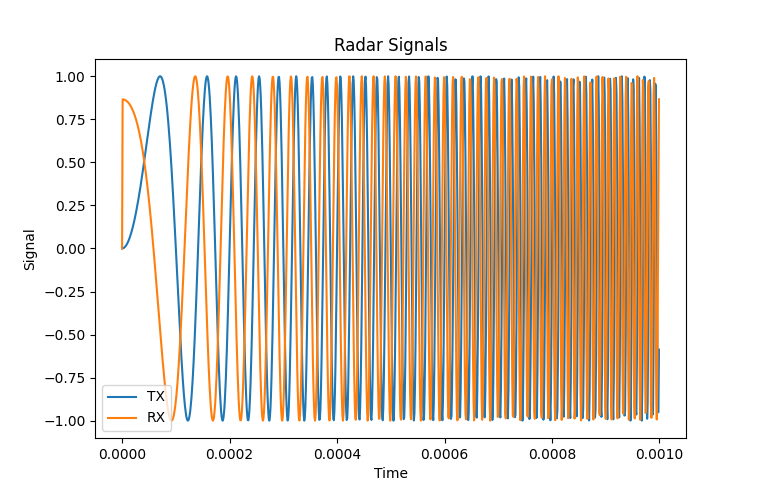
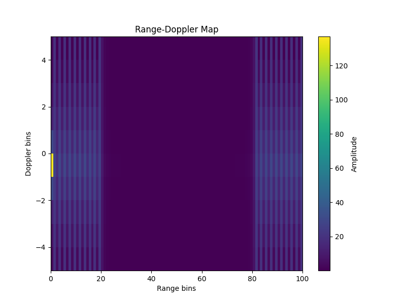

# FMCW Radar Simulation with Range-Doppler Analysis

This project simulates an FMCW radar system to estimate target distance and velocity using signal processing techniques such as FFT and 2D Range-Doppler mapping.

## Features
- FMCW signal generation (C++)
- Target reflection with delay and Doppler effect
- Signal mixing and beat frequency extraction
- FFT-based distance estimation
- 2D FFT Range-Doppler Map for velocity detection

  
## How It Works
1. A chirp signal is transmitted.
2. The signal reflects from a moving target.
3. The received signal is delayed and Doppler-shifted.
4. Mixing produces a beat signal.
5. FFT is applied to estimate range and velocity.

## Results

First try:

Estimated Distance: ~4500 meters  
Estimated Velocity: ~0 m/s 

After fixing some issues:

Estimated Distance: ~100 meters  
Estimated Velocity: 50~30 m/s 

## Accuracy & Limitations

The estimated distance and velocity are approximate rather than exact. This is due to several practical limitations:

- The model is a simplified FMCW radar simulation without advanced filtering.
- The beat frequency contains both range and Doppler components.
- FFT resolution is limited by sampling rate and signal duration.
- No windowing function is applied, leading to spectral leakage.
- The system operates on discrete samples, introducing quantization error.

## Improvements

Accuracy can be improved by:

- Increasing sampling frequency and chirp duration
- Applying windowing functions (e.g., Hanning window)
- Using Range-Doppler processing (2D FFT)
- Reducing noise or improving SNR

## What I Learned
- Practical implementation of FMCW radar systems
- Signal processing using FFT and 2D FFT
- Understanding Doppler effect in real-world systems
- Handling noise and multi-target scenarios
- That I need to improve this project more and more

  ## How to Run

### C++
g++ main.cpp -o radar
./radar

### Python
pip install -r requirements.txt
python radar_plot.py
python range_doppler.py

## Future Work
- Add noise and SNR analysis
- Multi-target detection
- Angle of Arrival (AoA) simulation
- Real radar dataset integration

  ## License
MIT License
